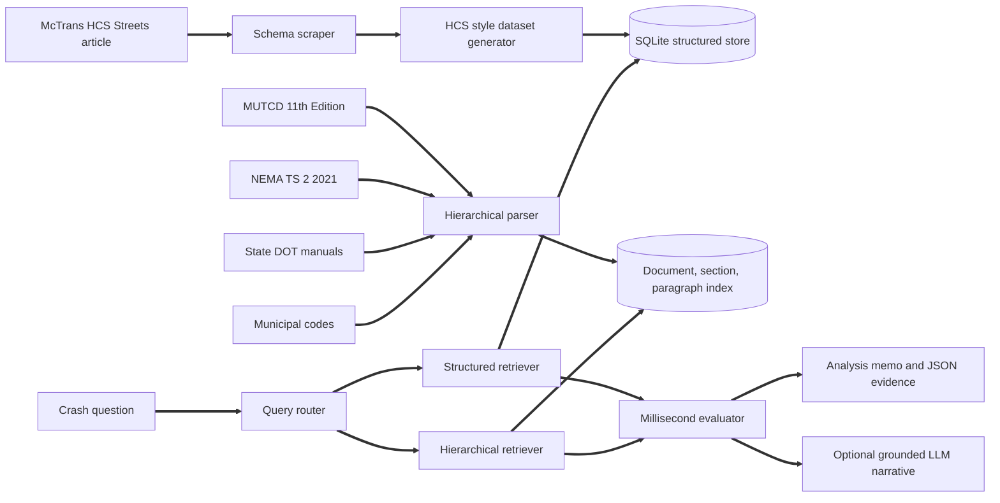

# Multi Jurisdictional Traffic Light Incident Legal Assistant

A hybrid structured and unstructured retrieval augmented generation (RAG) system that joins crash telemetry and millisecond controller logs with a hierarchical index of federal, state, local and hardware authority, then evaluates whether the yellow change and red clearance intervals met every governing requirement at the exact millisecond a vehicle crossed the stop line.

## Project Brief

When a multivehicle crash happens inside a signalized intersection, the first question every party asks is deceptively simple: what was the signal showing, and was it timed correctly? Answering it properly is anything but simple. A traffic engineer or legal analyst has to reconcile at least four bodies of authority that were never written to be read together. The federal Manual on Uniform Traffic Control Devices (MUTCD) sets the national floor. A state Department of Transportation manual usually fixes the kinematic method, the speed basis and its own minimums. A municipal code may add stricter local minimums, speed adjustments and maintenance deadlines. Finally, hardware standards such as NEMA TS 2 define how the controller and its malfunction management unit (MMU) are supposed to behave when timing goes wrong.

Those documents then have to be laid against raw evidence: high resolution controller event logs, detector fault histories, MMU logs, programmed timing plans and the speed and position of the vehicle from an event data recorder, video analytics or connected vehicle data. In practice this cross referencing is done by hand, spreadsheet by spreadsheet and PDF by PDF, and a single contested crash can consume hundreds of analyst hours. The work is also fragile. It is easy to apply the wrong state's policy to a city signal, to overlook a local ordinance that is stricter than the state manual, or to compare the programmed yellow with the requirement while missing that the controller actually displayed something different in the crash cycle.

This project automates that reconciliation. It treats the problem as hybrid retrieval: structured questions (which interval was each phase displaying at 07:36:36.755, and was it the same in every other cycle of the plan?) are answered by SQL over the controller database, while normative questions (which provision creates the duty, and is it a mandatory Standard or advisory Guidance?) are answered by hierarchical retrieval over the manuals, restricted to the jurisdiction that owns the intersection. An evaluation engine combines both into a structured finding set and an analysis memorandum in which every conclusion carries its measured value, its required value and a citation down to section, paragraph, provision type and printed page.

The data foundation follows the HCS Streets CSV export described by the McTrans Center article "Integrating HCS Signal Analyses with Excel for Efficient Traffic Studies" (mctrans.ce.ufl.edu, encoded link: [McTrans article](https://mctrans.ce.ufl.edu/integrate%2Dhcs%2Dsignal%2Danalyses%2Dwith%2Dexcel%2Dfor%2Defficient%2Dtraffic%2Dstudies/)). That article does not publish a downloadable table; it documents which parameters the export contains (intersection geometry, traffic, signal controller settings and performance measures) and how analysts build 2023, 2030 and 2035 scenarios from it. The project scrapes that parameter schema, maps each parameter to dataset columns, and generates a 16,320 row by 52 column HCS style dataset plus the incident telemetry that sits on top of it.

## What the Assistant Answers

<table>
<tr><th>Question type</th><th>Example</th><th>Route</th><th>Sources used</th></tr>
<tr><td>Crash liability analysis</td><td>Did the yellow interval meet requirements in crash CR00004?</td><td>HYBRID_CRASH</td><td>Controller log, telemetry, timing plan, detector and MMU logs, MUTCD, state manual, municipal code, NEMA TS 2</td></tr>
<tr><td>Signal state at a moment</td><td>What was INT0105 showing at 2025/09/18 07:36:36.755?</td><td>STRUCTURED_STATE</td><td>Controller log plus MUTCD indication meanings</td></tr>
<tr><td>Intersection profile</td><td>Show INT0012</td><td>INTERSECTION_PROFILE</td><td>HCS style timing table and crash history</td></tr>
<tr><td>Regulatory research</td><td>What is the minimum yellow change interval in the City of Northgate?</td><td>REGULATORY</td><td>Hierarchical retrieval, filtered to that city and its state</td></tr>
</table>

## Architecture



The unique capability is the join at the evaluator. It locates the interval every phase was displaying at the stop line entry millisecond, reconstructs where the vehicle was when yellow began, computes the governing requirement layer by layer, and then attaches the provisions that create each duty.

## Data

### Source and construction

The scraper (`trafficlegal/scraper.py`) downloads the McTrans article, extracts each bolded parameter group and its comma separated parameters, and maps all 21 scraped parameters to dataset columns. The mapping is saved to `data/raw/source_schema.json`. When the network is unavailable, a snapshot verified against the live article on 2026/09/30 is used so the pipeline stays reproducible.

Because the article supplies a schema rather than rows, the records themselves are synthetic. The generator (`trafficlegal/synth.py`) builds 170 intersections with dual ring, eight phase NEMA operation, assigns each to a jurisdiction, programs clearance intervals under one of three timing practices, allocates splits from HCM flow ratios for four timing plans, and computes HCM performance measures for the three scenario years named in the article. Crash windows are then simulated at millisecond resolution around the 2023 timing plans, with injected controller deviations, detector faults and MMU responses. Every crash carries a hidden ground truth label that the evaluator never reads, which makes objective benchmarking possible.

The two states (Avalon and Kestrel) and six municipalities are fictional. Their policy documents in `knowledge/state` and `knowledge/local` are generated from the same parameters the evaluator applies and carry a prominent synthetic notice. This allows the federal, state and local precedence logic to be exercised end to end without misrepresenting the law of any real place.

### Tables

<table>
<tr><th>Table</th><th>Rows</th><th>Columns</th><th>Grain and purpose</th></tr>
<tr><td>hcs_streets_export</td><td>16,320</td><td>52</td><td>Lane group by analysis period by scenario year (2023, 2030, 2035). Geometry, traffic, controller settings, HCM performance and clearance compliance.</td></tr>
<tr><td>signal_event_log</td><td>99,840</td><td>20</td><td>One row per phase interval (green, yellow, red clearance) over eight cycles around each crash, with epoch milliseconds, Indiana high resolution event codes, displayed and programmed durations.</td></tr>
<tr><td>crash_events</td><td>520</td><td>26</td><td>Impact and stop line entry times, subject and conflicting phase, telemetry reference point (speed and distance), conditions and the hidden benchmark label.</td></tr>
<tr><td>detector_faults</td><td>1,472</td><td>16</td><td>Open loop, shorted loop, excessive inductance change and watchdog failures with start, detection and clearance times.</td></tr>
<tr><td>mmu_events</td><td>394</td><td>10</td><td>Minimum yellow change faults, conflicts, red fail, Port 1 timeouts and voltage monitor trips.</td></tr>
<tr><td>signal_timing_plans</td><td>5,440</td><td>12</td><td>Cycle, offset, split, green, clearance, minimum green and passage time per plan and phase.</td></tr>
<tr><td>lane_group_geometry</td><td>1,360</td><td>18</td><td>Static per phase geometry, speeds and programmed clearances.</td></tr>
<tr><td>intersections</td><td>170</td><td>14</td><td>Inventory: jurisdiction, control type, controller standard, timing practice, area type.</td></tr>
<tr><td>jurisdiction_policy</td><td>6</td><td>20</td><td>State and local policy parameters that drive the governing requirement.</td></tr>
</table>

An Excel workbook (`data/processed/hcs_streets_export.xlsx`) mirrors the McTrans workflow with the full export, a scenario summary sheet and a clearance deficit sheet.

### Main table columns

<table>
<tr><th>Group (from the article)</th><th>Columns</th></tr>
<tr><td>Identification</td><td>scenario_year, analysis_period, timing_plan_id, state_code, jurisdiction_code, jurisdiction_name, intersection_id, intersection_name, corridor, area_type, control_type, controller_standard, timing_practice, nema_phase, ring, barrier, movement, approach, lane_group_kind</td></tr>
<tr><td>Intersection geometry</td><td>num_lanes, lane_width_ft, storage_length_ft, grade_pct, grade_direction, intersection_width_ft</td></tr>
<tr><td>Traffic</td><td>posted_speed_mph, speed_85th_mph, clearance_speed_mph, demand_vph, heavy_vehicle_pct, bicycles_vph, buses_per_hr, peak_hour_factor</td></tr>
<tr><td>Signal controller settings</td><td>cycle_length_s, offset_s, split_s, green_s, yellow_s, red_clearance_s, min_green_s, passage_time_s</td></tr>
<tr><td>Performance measures</td><td>saturation_flow_vph, capacity_vph, vc_ratio, control_delay_s, los, back_of_queue_ft, queue_storage_ratio</td></tr>
<tr><td>Clearance compliance</td><td>required_yellow_s, required_red_clearance_s, yellow_shortfall_s, red_clearance_shortfall_s</td></tr>
</table>

Grades are stored as a magnitude plus an uphill, downhill or level label, and shortfalls as non negative values, so every numeric column is non negative and every file stays free of dash characters.

## Key Findings

**Timing practice, not geography, is the dominant driver of clearance deficiencies.** Across the 1,360 lane groups in the 2023 timing plans, intersections timed with the full kinematic method under the governing policy show no yellow shortfall at all. Intersections timed to the posted speed only, ignoring an 85th percentile speed basis or a local speed adjustment, fall short on 72.8 percent of lane groups by an average of 0.38 s. Legacy flat timings (3.5 s through, 3.0 s left, 1.0 s red clearance) fall short on 82.2 percent of lane groups by an average of 0.79 s, and 77.6 percent of those lane groups also carry too little red clearance.

**Jurisdiction changes the answer for identical hardware.** The same programmed yellow can be compliant in one city and deficient in the next. Kestrel requires timing to the measured 85th percentile speed, and 35.8 percent of its lane groups show a yellow shortfall against 25.6 percent in Avalon, which times to the posted limit. Local layers matter as well: Stonebridge requires 1.2 s of red clearance, so a 1.0 s red clearance that satisfies the Kestrel state minimum still fails locally. This is exactly the class of error that manual cross referencing tends to miss.

**Future demand erodes performance under existing timings.** Holding 2023 plans constant, the share of lane groups at LOS F rises from 12.2 percent in 2023 to 21.2 percent in 2030 and 28.5 percent in 2035. Mean control delay climbs from 53.0 s to 61.0 s to 69.9 s, and the share of lane groups whose back of queue exceeds available storage roughly doubles from 11.2 percent to 23.6 percent. This reproduces the scenario analysis the McTrans article describes and flags where retiming studies should begin.

**The evaluator separates driver behaviour from signal deficiency.** Of 520 benchmark crashes, the evaluator classifies 99.4 percent correctly. Every one of the three misclassifications was flagged as moderate confidence by the speed uncertainty test, while the 82.7 percent of verdicts issued with high confidence were correct in every case. For legal use this calibration is more valuable than the headline accuracy: it tells the analyst exactly which findings need an expert's second look.

## Hierarchical Retrieval

Documents are parsed into a three level tree by `trafficlegal/ingest.py`:

<table>
<tr><th>Level</th><th>Unit</th><th>Example</th></tr>
<tr><td>1. Document</td><td>Tier (FEDERAL, STATE, LOCAL, HARDWARE) and jurisdiction</td><td>MUTCD 11th Edition, FEDERAL</td></tr>
<tr><td>2. Section</td><td>MUTCD section, policy clause or NEMA clause with chapter and printed page</td><td>Section 4F.17 Yellow Change and Red Clearance Intervals, page 708</td></tr>
<tr><td>3. Paragraph</td><td>Numbered paragraph tagged Standard, Guidance, Option, Support, Clause or Specification</td><td>Paragraph 08, Standard: the yellow change interval shall not vary cycle by cycle within a timing plan</td></tr>
</table>

The MUTCD parses into 954 sections and 6,388 paragraphs. Provision types carry legal weight: a Standard uses "shall" and is mandatory, Guidance uses "should", an Option uses "may" and Support is informational. Page citations are resolved per page so the pdftotext and pypdf extraction paths produce identical citations.

Retrieval (`trafficlegal/retriever.py`) runs in three stages:

1. **Routing.** The corpus is restricted to the requested tiers and to the state and municipality that own the intersection. A Kestrel crash is never argued with Avalon policy, and a test enforces this.
2. **Section ranking.** BM25 over section headings (weighted three times) and bodies, run separately inside each tier, with min max normalisation of section scores. Explicit section references in a query, such as 4F.17, are pinned.
3. **Paragraph ranking.** BM25 over paragraphs inside the winning sections only, multiplied by a provision weight (Standard 1.25, Guidance 1.12, Support 0.92) and blended with the parent section score. Results are diversified so each tier contributes evidence.

The lexical layer includes a light plural stemmer and a traffic engineering thesaurus (amber to yellow, all red to red clearance, loop to detector, MMU to malfunction management unit). It needs no model downloads and runs offline.

## The Millisecond Evaluation

`trafficlegal/evaluator.py` reconstructs the event from the telemetry reference point under a constant speed assumption, checks that reconstruction against the recorded stop line entry, and then runs these checks:

<table>
<tr><th>Check</th><th>What is tested</th><th>Primary authority</th></tr>
<tr><td>INDICATION_AT_ENTRY</td><td>Interval displayed by the subject phase at the entry millisecond</td><td>Controller log</td></tr>
<tr><td>MUTCD_YELLOW_RANGE</td><td>Programmed yellow between 3 and 6 s</td><td>MUTCD 4F.17 Paragraph 13 (Guidance)</td></tr>
<tr><td>YELLOW_CONSISTENCY</td><td>Displayed yellow equals programmed yellow in every logged cycle of the plan</td><td>MUTCD 4F.17 Paragraphs 07 and 08 (Standard), state Clause 3.4</td></tr>
<tr><td>RED_CLEARANCE_CONSISTENCY</td><td>Red clearance not decreased or omitted in the crash cycle</td><td>MUTCD 4F.17 Paragraph 09 (Standard)</td></tr>
<tr><td>YELLOW_REQUIREMENT</td><td>Programmed yellow against the strictest of the federal, state kinematic, state minimum and local layers</td><td>MUTCD 4F.17 Paragraph 03, state Clause 3.2, local Sections 1.02, 1.04, 1.05</td></tr>
<tr><td>RED_CLEARANCE_REQUIREMENT and MAXIMUM</td><td>Programmed red clearance against the governing minimum and the 6 s guidance</td><td>MUTCD 4F.17 Paragraphs 06 and 13, state Clause 3.3, local Section 1.03</td></tr>
<tr><td>DILEMMA_ZONE</td><td>Type I dilemma zone: the vehicle could not stop comfortably and did not reach the stop line before red</td><td>ITE kinematics, MUTCD 4F.17 Paragraph 01</td></tr>
<tr><td>INDECISION_ZONE</td><td>Type II zone: 2.5 to 5.5 s of travel from the stop line at yellow onset</td><td>Engineering practice</td></tr>
<tr><td>MMU_RESPONSE</td><td>If the displayed yellow fell below the MMU threshold, did the MMU trip?</td><td>NEMA TS 2 4.4.5 and 2.3.8, state Clause 3.5</td></tr>
<tr><td>DETECTOR_STATUS</td><td>Active detector faults on the subject phase and whether the local repair window was exceeded</td><td>State Clause 3.6, local Section 1.06, MUTCD 4A.10</td></tr>
<tr><td>CONFLICTING_RELEASE and TELEMETRY_CONSISTENCY</td><td>Time from subject red to conflicting green; agreement between telemetry and the recorded entry</td><td>Controller log and telemetry</td></tr>
</table>

The governing yellow is `max(3.0 s MUTCD floor, ITE kinematic value, state minimum, local minimum, local high speed minimum)`, capped at the 6 s MUTCD guidance, where the ITE value is `t + v / (2a + 2Gg)` with the state's reaction time, deceleration and speed basis plus any local speed adjustment. When layers tie, the memo names every layer that governs.

Verdicts are assigned in priority order: CONTROLLER_TIMING_DEVIATION, YELLOW_TIMING_BELOW_REQUIREMENT, DETECTION_SYSTEM_FAULT, NO_SIGNAL_DEFICIENCY_RED_ENTRY and NO_SIGNAL_DEFICIENCY_LAWFUL_ENTRY. Confidence drops to moderate when the telemetry disagrees with the recorded entry by more than 150 ms, or when the stopping conclusion flips within a 1 mph speed uncertainty.

### Example memo excerpt

```text
# Signal Timing Incident Analysis: CR00004

Verdict: Yellow Timing Below Requirement
Programmed yellow change interval was below the governing requirement and the
vehicle was trapped in a dilemma zone. Confidence: High.

* Location: Meridian Road and Walnut Street (INT0105), City of Stonebridge, State of Kestrel.
* Yellow onset 2025/09/18 07:36:33.013, red onset 2025/09/18 07:36:36.513,
  stop line entry 2025/09/18 07:36:36.755, impact 2025/09/18 07:36:37.670.
* Indication at entry: RED_CLEARANCE (0.242 s after red onset).
* Vehicle: 41.5 mph, 234.4 ft from the stop line at yellow onset.
* Approach: posted 35.0 mph, 85th percentile 40.4 mph.

Governing yellow: 3.96 s from state kinematic, clearance speed 40.4 mph (programmed 3.5 s).
Governing red clearance: 1.2 s from local minimum (programmed 1.0 s).
```

Each finding in the full memo is followed by quoted authority, for example MUTCD 11th Edition, Section 4F.17, Paragraph 03, Standard, page 708, then the Kestrel directive Clause 3.2 and the Stonebridge code Section 1.02. Each run writes two files to `artifacts/reports`: `CRxxxxx.md`, the readable memo, and `CRxxxxx.json`, which keeps every fact, check and evidence paragraph verbatim for preservation and expert review. The memo renders dash characters in quoted excerpts as spaces to keep the output dash free; set `TRAFFICLEGAL_VERBATIM_MEMO=1` to quote manuals exactly.

## Benchmarks

Run `python run.py benchmark`. Results on the shipped data (seed 20260930):

<table>
<tr><th>Verdict</th><th>Support</th><th>Precision</th><th>Recall</th></tr>
<tr><td>CONTROLLER_TIMING_DEVIATION</td><td>98</td><td>1.000</td><td>1.000</td></tr>
<tr><td>DETECTION_SYSTEM_FAULT</td><td>72</td><td>1.000</td><td>1.000</td></tr>
<tr><td>NO_SIGNAL_DEFICIENCY_LAWFUL_ENTRY</td><td>82</td><td>1.000</td><td>1.000</td></tr>
<tr><td>NO_SIGNAL_DEFICIENCY_RED_ENTRY</td><td>194</td><td>0.985</td><td>1.000</td></tr>
<tr><td>YELLOW_TIMING_BELOW_REQUIREMENT</td><td>74</td><td>1.000</td><td>0.960</td></tr>
</table>

Overall accuracy is 0.994. Accuracy is 1.000 for high confidence verdicts (82.7 percent of cases) and 0.967 for moderate confidence verdicts. The labels come from the same generator the evaluator was designed around, so this benchmark verifies that the reasoning is internally correct and well calibrated; it is not evidence of field accuracy.

Retrieval is scored on 16 analyst style questions with known target sections in the MUTCD and NEMA TS 2: hit rate at 1 is 0.75, hit rate at 3 is 0.875 and mean reciprocal rank is 0.84. The section blend weight was chosen on this same question set, so treat these figures as optimistic and extend `RETRIEVAL_CASES` in `trafficlegal/benchmark.py` with held out questions before relying on them.

## Quick Start

Requires Python 3.10 or newer. Poppler's `pdftotext` is used when present for fast PDF extraction; otherwise pypdf is used automatically and the first index build takes a few minutes. The extracted text is then cached.

```bash
pip install .
python run.py setup
python run.py benchmark
python run.py evaluate CR00004
python run.py ask "What is the minimum yellow change interval in the City of Northgate?"
python run.py serve
pytest
```

`setup` runs the scrape, generate, excel, ingest and builddb steps in order. After installation the same commands are also available as `trafficlegal <command>`.

### Command reference

<table>
<tr><th>Command</th><th>Purpose</th><th>Options</th></tr>
<tr><td>setup</td><td>Full pipeline from scrape to database</td><td></td></tr>
<tr><td>scrape</td><td>Scrape the article schema</td><td></td></tr>
<tr><td>generate</td><td>Build every dataset and the policy documents</td><td>intersections=170 crashes=520 seed=20260930</td></tr>
<tr><td>excel</td><td>Write the HCS style workbook</td><td></td></tr>
<tr><td>ingest</td><td>Parse the knowledge base into the hierarchical index</td><td></td></tr>
<tr><td>builddb</td><td>Load the CSV tables into SQLite</td><td></td></tr>
<tr><td>crashes</td><td>List crashes</td><td>limit=20 intersection=INT0001</td></tr>
<tr><td>evaluate CRASH_ID</td><td>Millisecond evaluation and memo</td><td></td></tr>
<tr><td>ask "QUESTION"</td><td>Routed free text question</td><td></td></tr>
<tr><td>retrieve "QUERY"</td><td>Hierarchical retrieval only</td><td>state=KS jurisdiction=NGT k=8</td></tr>
<tr><td>sql "SELECT ..."</td><td>Read only SQL against the structured store</td><td>limit=200</td></tr>
<tr><td>benchmark</td><td>Verdict and retrieval benchmarks</td><td></td></tr>
<tr><td>serve</td><td>Start the HTTP API</td><td>host=127.0.0.1 port=8000</td></tr>
</table>

Options use the form `key=value` throughout.

### HTTP API

Interactive documentation is available at `/docs` once the server is running.

<table>
<tr><th>Method and path</th><th>Purpose</th></tr>
<tr><td>GET /health</td><td>Liveness and version</td></tr>
<tr><td>GET /crashes</td><td>List crashes, optionally filtered by intersection_id</td></tr>
<tr><td>GET /crashes/{crash_id}/evaluation</td><td>Full structured evaluation with evidence</td></tr>
<tr><td>GET /crashes/{crash_id}/memo</td><td>Markdown memorandum</td></tr>
<tr><td>POST /ask</td><td>Routed question: {"question": "...", "save_report": false}</td></tr>
<tr><td>GET /retrieve</td><td>Hierarchical retrieval with optional state_code and jurisdiction_code</td></tr>
<tr><td>POST /sql</td><td>Read only single SELECT statements with a row cap</td></tr>
</table>

### Docker

```bash
docker compose up
```

`compose.yaml` builds the image from the Dockerfile, which installs the package, runs the full setup pipeline during the build and serves the API on port 8000.

## Configuration

<table>
<tr><th>Variable</th><th>Default</th><th>Effect</th></tr>
<tr><td>TRAFFICLEGAL_DATA_DIR</td><td>data</td><td>Location of raw and processed tables</td></tr>
<tr><td>TRAFFICLEGAL_KNOWLEDGE_DIR</td><td>knowledge</td><td>Location of manuals and policy documents</td></tr>
<tr><td>TRAFFICLEGAL_ARTIFACT_DIR</td><td>artifacts</td><td>Index, database, text cache, reports and benchmark output</td></tr>
<tr><td>TRAFFICLEGAL_MMU_MIN_YELLOW_S</td><td>2.7</td><td>MMU minimum yellow threshold used by the MMU_RESPONSE check</td></tr>
<tr><td>TRAFFICLEGAL_VERBATIM_MEMO</td><td>unset</td><td>Set to 1 to quote manuals verbatim in the Markdown memo</td></tr>
<tr><td>TRAFFICLEGAL_LLM_MODEL and ANTHROPIC_API_KEY</td><td>unset</td><td>When both are set, a Claude model writes a short narrative grounded only in the computed findings and numbered evidence</td></tr>
</table>

Engineering constants (reaction time, deceleration, vehicle length, tolerances) and retrieval weights live in `trafficlegal/config.py`.

## Repository Layout

```text
signal_incident_legal_assistant/
    run.py                      command line entry point
    setup.py                    package definition (pip install .)
    requirements.txt
    Dockerfile
    LICENSE
    trafficlegal/
        config.py               paths, kinematic constants, tolerances, retrieval weights
        utils.py                dash free arithmetic helpers, millisecond time formatting
        scraper.py              McTrans schema scraper with verified offline snapshot
        hcm.py                  HCM lane group performance and ITE clearance equations
        jurisdictions.py        state and local policy registry and governing requirement logic
        policydocs.py           generator for the fictional state manuals and municipal codes
        synth.py                HCS style dataset and incident log generator
        ingest.py               PDF and Markdown parsing into document, section, paragraph trees
        bm25.py                 BM25 with plural stemming and a traffic thesaurus
        retriever.py            tier routed hierarchical retriever
        store.py                SQLite loader and structured retriever
        evaluator.py            millisecond clearance evaluation and verdicts
        memo.py                 Markdown and JSON memorandum writer
        llm.py                  optional grounded narrative generation
        assistant.py            question router
        benchmark.py            verdict and retrieval benchmarks
        api.py                  FastAPI service
        cli.py                  commands
    knowledge/
        manifest.json           registry of static documents
        federal/                MUTCD 11th Edition
        hardware/               NEMA TS 2 2021 contents and scope
        state/                  generated state DOT policy manuals
        local/                  generated municipal codes
    data/
        raw/                    nine CSV tables and source_schema.json
        processed/              Excel workbook
    tests/                      engineering, data, knowledge, evaluator, API and style tests
```

## Testing and Style Convention

`pytest` runs 30 tests covering:

* **Engineering:** the ITE and HCM equations, LOS thresholds, dilemma zone logic and strictest layer governance.
* **Data:** size and non negativity, contiguous controller intervals, and that yellow deviations occur only in crash cycles.
* **Knowledge base:** MUTCD 4F.17 paragraph and provision structure, compatibility between the two PDF extractors, rejection of cross references as headings, and jurisdiction isolation.
* **Evaluator:** benchmark accuracy and red clearance omission citations.
* **Interfaces and scraper:** the API, SQL read only enforcement and parsing of the scraped article.

The repository contains no hyphen or dash character in any source file, data file, document or file name, and `tests/test_style.py` enforces this on every run. Subtraction is written with `operator.sub` and `numpy.subtract`, negation with `operator.neg` and `numpy.negative`, regular expression letter classes are spelled out from `string.ascii_uppercase`, and the command line uses `key=value` options instead of flags. The live McTrans URL, which does contain hyphens, is assembled at runtime from its words and stored on disk in percent encoded form.

## Limitations and Responsible Use

This is engineering decision support, not legal advice, and every memo says so. Findings depend on the integrity of the controller logs and on the telemetry: the vehicle is reconstructed at constant speed from a single reference point, so braking before the stop line is not modelled. The simulated data, fictional jurisdictions and synthetic policy documents are designed to exercise the reasoning, not to describe any real intersection.

The NEMA TS 2 document supplied here contains only the contents, front matter and scope, so hardware citations point to clause titles and page numbers rather than clause text. The 2.7 s MMU minimum yellow threshold is a configurable value and should be verified against a licensed copy of TS 2 Section 4.4.5 before any real use. The lexical retriever will miss paraphrases that share no vocabulary with the manual; a dense embedding stage can be added alongside BM25 in `retriever.py` without changing the hierarchy or the citations.

## Extending to Real Jurisdictions

1. Add the state DOT manual and municipal code files to `knowledge/state` and `knowledge/local` (Markdown with `## Section` or `## Clause` headings, or PDF with a manifest entry), then register them in `ingest.discover_documents` or `knowledge/manifest.json`.
2. Replace the policy parameters in `trafficlegal/jurisdictions.py` with values taken from those documents, and update the pinned citations in `evaluator.PINS`.
3. Load real high resolution controller logs into `signal_event_log` using the same column contract (epoch milliseconds, interval type, displayed and programmed durations). For windows that are not tied to a crash, look up intervals by `intersection_id` and time.
4. Run `python run.py ingest`, `python run.py builddb` and `pytest`.

## License and Document Rights

The code is released under the MIT License. The MUTCD is published by the Federal Highway Administration. NEMA TS 2 is copyrighted by the National Electrical Manufacturers Association and is included only in the contents and scope form supplied for this project. The McTrans article is the property of the University of Florida McTrans Center; only its parameter schema is used.
